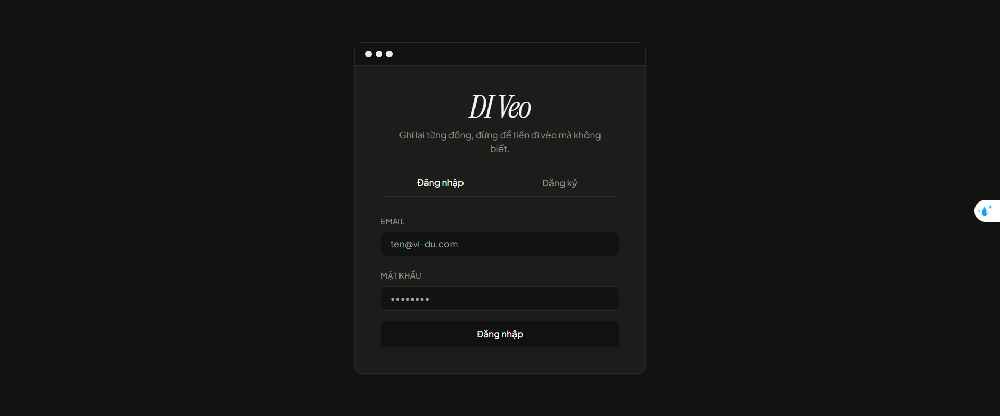
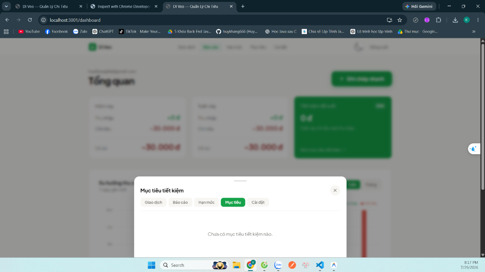

# 💸 DI Veo — Quản Lý Chi Tiêu Sinh Viên

**DI Veo** là ứng dụng web giúp quản lý thu chi cá nhân được thiết kế theo phong cách tối giản (Editorial UI), tối ưu hóa trải nghiệm thao tác nhanh cho sinh viên và người có thu nhập không cố định.

---

## 🌟 Tính Năng Nổi Bật

*   ⚡ **Ghi Chép Giao Dịch Trong 3 Giây**: Sử dụng QuickAdd bottom sheet tiện lợi, lưu giao dịch nhanh chóng không cần chuyển trang.
*   🧭 **Popup Tab Navigation (NavDrawer)**: Bottom sheet chiếm 92vh với chiều rộng max-w-4xl tràn màn hình, tích hợp đầy đủ 5 phân hệ chính:
    *   **Giao dịch**: Lọc theo thời gian/danh mục, trực tiếp sửa & xóa giao dịch.
    *   **Báo cáo**: Biểu đồ tròn Recharts phân bổ chi phí, thống kê động theo Tuần/Tháng & xuất file Excel trực tiếp.
    *   **Hạn mức**: Cấu hình hạn mức chi tiêu trực quan cho từng danh mục.
    *   **Mục tiêu**: Lên kế hoạch tiết kiệm, cập nhật tiến độ tích lũy thông minh.
    *   **Cài đặt**: Điều chỉnh nhanh tỉ lệ tiết kiệm đề xuất cho tuần kế tiếp.
*   📈 **Xu Hướng Thu Chi (Chart)**: Biểu đồ cột Recharts hỗ trợ chuyển đổi chế độ xem linh hoạt giữa Tuần & Tháng, tự động rút gọn số tiền thông minh (k, tr).
*   📱 **Giao diện Minimalist Editorial**: Tông màu xanh tươi mới sáng sủa (`#16A34A`), font chữ Sans-serif hiện đại, tối ưu hóa hiển thị.

---

## 📸 Hình Ảnh Giao Diện

### 1. Màn hình Đăng nhập tối giản


### 2. Dashboard Tổng quan & Popup Mục tiêu Tiết kiệm


---

## 🛠️ Công Nghệ Sử Dụng

*   **Framework**: Next.js 14+ (App Router) + TypeScript
*   **Styling**: Tailwind CSS
*   **Database & Auth**: Supabase (PostgreSQL + Supabase Auth)
*   **ORM**: Prisma
*   **Thư viện biểu đồ**: Recharts
*   **Xử lý File**: XLSX (Xuất Excel trực tiếp trên Client)

---

## 🚀 Hướng Dẫn Cài Đặt & Chạy Cục Bộ

### 1. Cài đặt các gói phụ thuộc
```bash
npm install
```

### 2. Cấu hình biến môi trường
Tạo file `.env` từ file mẫu `.env.example`:
```bash
cp .env.example .env
```
Điền đầy đủ thông tin kết nối Supabase và Database của bạn:
```env
DATABASE_URL="postgres://..."
DIRECT_URL="postgres://..."
NEXT_PUBLIC_SUPABASE_URL="https://..."
NEXT_PUBLIC_SUPABASE_ANON_KEY="..."
```

### 3. Đồng bộ Database & Seed dữ liệu mẫu
Khởi chạy Migration Prisma để tạo các bảng dữ liệu và nạp danh mục mặc định:
```bash
npx prisma migrate dev --name init
npx prisma db seed
```

### 4. Chạy Development Server
```bash
npm run dev
```
Mở [http://localhost:3000](http://localhost:3000) trên trình duyệt của bạn.

---

## 📦 Hướng Dẫn Deploy Lên Vercel

1. Đẩy mã nguồn của bạn lên một repo trên GitHub.
2. Truy cập [Vercel](https://vercel.com) và Import repo vừa tạo.
3. Tại phần cấu hình **Environment Variables**, điền đầy đủ các biến môi trường sau:
   - `DATABASE_URL` (Connection string dạng Transaction)
   - `DIRECT_URL` (Connection string kết nối trực tiếp - dùng cho migrations)
   - `NEXT_PUBLIC_SUPABASE_URL`
   - `NEXT_PUBLIC_SUPABASE_ANON_KEY`
4. Nhấn **Deploy** và tận hưởng ứng dụng!
